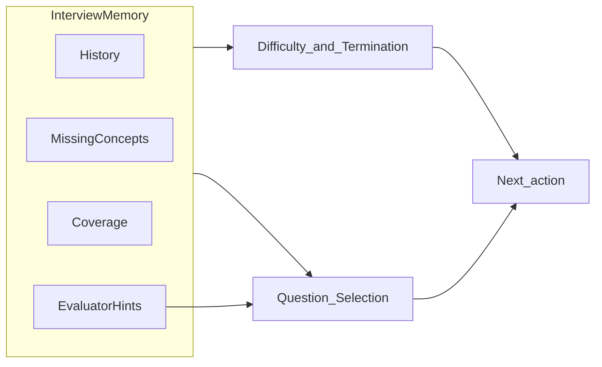

# 论文创新点

**问题**：技术面试在**有限题量**、**观测不完整**、评测信号（规则/LLM）**不可靠**时，需在每一轮决定：下一题、是否追问、是否终止——即**序贯决策**。

**创新总貌**：不是「固定题本 + 单次打分」，而是 **持久记忆 + 受限动作 + 工具编排**；其中 **C2** 把难度/终止与选题绑在同一记忆上（联合自适应）    **知识+表情的CAT**，**C3** 对**全会话轨迹**做分析型报告，**C4** 同时包含可部署的**学习者体验**实证设计。

1. interview系统的总体评估
2. 其他面试系统的创新点

---

## 2. C1：memory-aware Agentic  interview framework

### 创新点

- **技术**：将面试形式化为 **观测 → 记忆 → 状态 → 策略 → 动作 → 工具 → 反馈** ；记忆 \(m_t\) 显式存储历史、分数/难度轨迹、章节覆盖、缺失概念、简历先验、评估器提示等，再压缩为状态 \(s_t\)。

- **新意**：与「单轮 Prompt + LLM 自由发挥」不同，动作空间固定为
  $$
  \{\textit{ask-next},\textit{follow-up},\textit{terminate}\}
  $$

- **定位**：借鉴 **工具增强 / Agent** 思想，但强调 **面试测评场景下的约束编排**，而非开放域 ReAct。

### 具体怎么做

- **问题形式化与表示**：在 **Method** 前半依次有「问题形式化」「观测」「面试记忆」「状态」——说明 \(m_t\) 里有哪些轨迹、\(s_t\) 如何压缩。
- **控制器与追问**：专门两小节写 **规划器/控制器**(controller)（如何从状态选动作）和 **追问规划**（何时追问、如何生成追问）。
- **工具体系**(Tools)：在 **工具与架构** 一节用一张 **工具清单表** 列出判分、校验、追问、简历解析、报告等模块及各自回退方式。

**实现**

| 路径 | 职责 |
|------|------|
| [`interview/backend/agent/controller.py`](../backend/agent/controller.py) | **AgentController**：闭环编排（观察→记忆更新→状态→动作→工具），可选启用 |
| [`interview/backend/agent/memory.py`](../backend/agent/memory.py) | **MemoryManager**：会话级记忆结构与更新 |
| [`interview/backend/agent/state_builder.py`](../backend/agent/state_builder.py) | 将记忆压缩为控制器使用的状态 |
| [`interview/backend/agent/tools.py`](../backend/agent/tools.py) | 规则/LLM 判分、校验、追问、简历等工具封装 |
| [`interview/backend/services/interview_engine.py`](../backend/services/interview_engine.py) | 业务侧面试主流程，与选题、自适应、评测衔接 |

### 如何评估

- 测试整体性：看端到端会话日志里是否**持续写入**记忆字段（分数、章节、缺口等）、控制器动作与工具调用是否可追溯。论文在 **实验设计** 的「数据收集」里列出了应记录的字段；

- 对照 **消融** 中的「无记忆 / 每步清空状态」条件，看系统是否明显退化。

**其他论文对interview Framework的评测**

### 参考文献

- [Wang et al., 2023 — LLM 自主智能体综述](https://arxiv.org/abs/2308.11432) — 交代「工具 + 规划」的主流范式，本文采用**更小动作空间 + 确定性控制**的对比定位。
- [Yao et al., 2023 — ReAct](https://arxiv.org/abs/2210.03629) — 推理–行动循环的代表作；本文**不**采用 LLM 自由选工具链，而是固定工具与确定性路由，可对照说明差异。
- However, since these chatbots typically rely on predefined conversational capabilities and scripted questions, they lack the adaptability required for semi-structured interviews (Bulygin, [2022](https://arxiv.org/html/2504.13847v1#bib.bib7)).
- [Zhuang et al., 2024 — CAT 机器学习视角综述](https://arxiv.org/abs/2404.00712) Survey of Computerized Adaptive Testing: A Machine Learning Perspective 

high-stakes testing，将Agent应用到agent/AI系统评测上。

---

## 3. C2：预算约束下的联合自适应策略（难度/终止 × 状态条件化选题）

### 创新点（技术 + 新意）

- **技术**：**同一套记忆**同时驱动：（1）滑动窗口上的难度更新与多条件终止；（2）多目标近似选题（缺口、简历、覆盖、信息/探索项），并支持 **LLM-as-topic-planner** 建议章节 + 模糊校验，失败则 **P1–P3 优先级级联** 与可选 Fisher×UCB×个性化。
- **新意**：**评估–选题闭环**——LLM 评判输出的下一方向提示 \(\eta_t\) 可并入缺失概念/章节匹配，使「打分」直接影响「下一问考什么」；相对依赖 **IRT 大规模标定** 的 CAT，本文走**轻量启发式 + 预算上下界**，面向**题量很少的面试**。
- **与基线对比**：优于固定模板与随机选题（无缺口/无简历协同）。

### 具体怎么做

**论文（`main.tex`）**

- **难度与终止**：见 **自适应控制** 小节——题量上下界、四条终止条件（优秀提前结束、持续偏弱、覆盖+稳定、预算用尽）、滑动窗口与趋势项、启发式或 **目标分数控制** 两种难度更新策略。
- **选题与追问衔接**：见 **状态感知选题** 小节——多目标组合式、选题算法框、评估器下一方向 \(\eta_t\) 如何并入缺口与章节匹配；追问规则在 **追问规划** 小节。

**实现（代码锚点）**

| 路径 | 职责 |
|------|------|
| [`interview/backend/services/adaptive_interview.py`](../backend/services/adaptive_interview.py) | **AdaptiveInterviewEngine**：难度调整、终止条件、与回合预算相关的逻辑 |
| [`interview/backend/services/question_selector.py`](../backend/services/question_selector.py) | **选题**：章节/难度过滤、优先级、Thompson/个性化等策略 |
| [`interview/backend/agent/controller.py`](../backend/agent/controller.py) | 在启用 Agent 时统一调度自适应与选题决策 |

### 如何评估

- **评什么指标**：在 **实验设计** 的「指标」里定义了校准误差/校准准确率、收敛轮次、**缺口命中率**（人工标注的缺概念是否在随后 \(k\) 轮内被考到）、**章节覆盖率**、**简历相关选题比例**（人工评）等；这些直接对应「联合策略」是否又快又准又对题。
- **和谁比**：同一节 **基线** 给出 **固定题本**、**随机选题**（无状态条件）等；把系统跑在同一题库与预算下对比上述指标。
- **消融怎么做**：在同一节 **消融设计** 中，可关掉简历先验、关掉缺口优先、关掉 \(\eta_t\)、关掉追问，或切换难度策略（启发式 / 目标分数）、选题策略（加权随机 / Thompson / 个性化），看哪一项拉垮最明显。
- **结果怎么读**：**结果** 一章里先有一大段 **联合自适应策略**（难度曲线、校准表、终止统计等），其中 **选题质量** 小节单独给出优先级分布、缺口与覆盖相关表。当前不少数字来自 **复现脚本与合成会话**，答辩时需说明证据阶段；最终以真实被试数据为准。

### 参考文献（链接 + 大体解释）

- [Zhuang et al., 2024 — CAT 综述（ML 视角）](https://arxiv.org/abs/2404.00712) — 传统 CAT 的测量与选题控制；用于说明**面试场景约束**（题少、多维、追问）与经典 CAT 的差异。
- Van der Linden & Glas, 2006 — *Computerized Adaptive Testing*（专著，见 `references.bib`）— CAT 经典框架与 IRT 前提。
- Chen et al., 2022 — 个性化选题（EDM 会议，见 `references.bib` 中 `chen2022personalization`）— 自适应测评中的选题工作；本文额外耦合**终止与 \(\eta_t\)**。
- Chen et al., 2021 — 教育测评中的自适应测验进展（*EM:IP*，见 `references.bib` 中 `chen2021adaptive`）— 领域综述背景。

---

## 4. C3：报告管线

### 创新点

- **技术**：报告**不是**对最后一题做一次摘要，而是先把全会话压成 **结构化轨迹**（逐题摘要行、难度/章节轨迹、五维均值、简历与缺失知识点），再执行 **五步独立 LLM 调用**（叙事综合、五维 JSON 归因、缺口根因、学习建议列表、策略透明），**任一步失败可单独回退**到规则或空。
- **新意**：分析粒度覆盖 **会话级 / 题目级 / 维度级 / 诊断级 / 元认知（策略解释）**，与单次「生成一段评语」的 Demo 区分；策略步使候选人理解**系统为何升降难度、换章节**。

### 具体怎么做

**论文（`main.tex`）**

- 见 **工具与架构** 中 **报告合成器（多步）** 段落：说明如何把全会话压成上下文；文中还有两张表——**会话轨迹如何分层拆解**、**五步顺序分析各步输入输出**（不必记 LaTeX 内部表名，按表题在 PDF 里找即可）。

**实现（代码锚点）**

| 路径 | 职责 |
|------|------|
| [`interview/backend/services/report_generator.py`](../backend/services/report_generator.py) | 汇总评测、轨迹、调用深度分析与 Markdown 报告 |
| [`interview/backend/services/llm_provider.py`](../backend/services/llm_provider.py) | `generate_deep_report_analysis`：**五步顺序** LLM 与 `base_context` 拼装 |
| [`interview/backend/services/speech_analyzer.py`](../backend/services/speech_analyzer.py) | 单轮语音特征：语速、流畅度、紧张度、停顿等（写入 `speech_analysis_json`） |
| [`interview/backend/services/expression_analyzer.py`](../backend/services/expression_analyzer.py) | 单轮表情：DeepFace 七类情绪 + 面试向指标（写入 `expression_analysis_json`） |

### 报告里包含哪些内容（`summary_json` + Markdown 结构）

以下与 [`report_generator.py`](../backend/services/report_generator.py) 中 `generate_report` / `_generate_markdown` 一致；**多模态为辅助描述**，一般不进入核心打分决策（与论文 Limitations 一致）。

**A. 基本信息与技术评分**

- 面试方向、初始难度、总轮数/完成轮数、**综合得分**。
- **五维得分**（正确性、深度、清晰度、实用性、权衡分析）及逐题得分表数据。
- **综合评估**（`overall_summary`）、**各维度深度分析**（`dimension_analysis`，五步 LLM 之一）、**知识缺口深度分析**（`gap_analysis`）、**AI 面试策略解读**（`strategy_trace`，含难度轨迹、章节轨迹）。
- **优势 / 待改进**、**缺失知识点**、**学习建议**（列表）、**推荐题单**（含 LLM 推荐理由时写入 `recommended_questions_detail`）。

**B. 会话级多步分析（C3 核心）**

- `generate_deep_report_analysis` 五步：叙事综合、五维 JSON、缺口根因、学习规划、策略透明；与论文中 **五步分析步骤表** 一致。

**C. 语音表达分析（汇总段 + 逐题明细）**

数据来源：[`speech_analyzer.py`](../backend/services/speech_analyzer.py) 产出单题 `speech_analysis_json`，报告在**会话级**对多题做平均与趋势，并可调用 LLM 生成 `speech_summary["recommendations"]`。

| 维度 | 含义（0–1 或物理量） | 会话汇总里呈现 |
|------|----------------------|----------------|
| **语速 `speech_rate`** | 字/分钟 | 平均语速 |
| **流畅度 `fluency`** | 综合语速、停顿频率、平均停顿时长、修正次数等 | 平均流畅度 |
| **紧张度 `nervousness`** | 由语速/停顿/修正/识别置信度等启发式估计 | 平均紧张度、**紧张度趋势**（improving / stable / increasing） |
| **停顿频率 `pause_frequency`** | 次/分钟 | 平均停顿频率 |
| **平均停顿时长 `average_pause_duration`** | 秒 | 仅在「详细评价」逐题块中输出 |
| **识别置信度 `confidence`**、**修正次数 `corrections`** | ASR/转写质量相关 | 主要在逐题 `speech_analysis_json` 中 |
| **文本分析子字段 `analysis`** | 含 `speech_rate_desc`、`fluency_desc`、`nervousness_desc`、等级标签（如 `fluency_level`、`nervousness_level`）及 `recommendations` | 逐题 Markdown 中展示 |

若全程未使用语音：`speech_summary.available == false`，并给出提示文案。

**D. 表情分析（汇总段 + 逐题明细）**

底层：[`expression_analyzer.py`](../backend/services/expression_analyzer.py) 使用 **DeepFace** 得到 **7 类基本情绪**（`angry, disgust, fear, happy, sad, surprise, neutral`）及 `emotion_scores`；再映射为面试向 **`interview_relevance`**。

| 层次 | 内容 |
|------|------|
| **原始情绪** | `dominant_emotion`（主导情绪）、`emotion_scores`（各类 0–1 归一化） |
| **面试向解读 `interview_relevance`** | **紧张度 `nervousness`**（fear/sad/disgust/angry/surprise 等加权）；**自信等级 `confidence_level`**（confident / moderate / nervous）及 **`confidence_desc` 文案**；**投入度 `engagement`**（focused / engaged）及 **`engagement_desc`**；**建议列表 `recommendations`**（最多 3 条） |

若未开启表情采集：`expression_summary.available == false`，并给出提示文案。

### 如何评估

- **定性怎么查**：打开若干真实会话生成的报告，逐条对照五步——综合叙事是否扣题、五维 JSON 是否与逐题分一致、缺口根因是否非简单罗列、学习建议是否可执行、策略段是否说清难度/章节轨迹。任一步关掉 LLM 时，规则回退是否仍能读完（见 **结果** 里 **会话级报告管线** 一段的写法）。
- **定量（仍待补）**：可对报告做人工 **忠实度 / 可执行性** 量表，或与金标报告对比；论文中若仍为 TODO，答辩时勿 overstating。
- **与实验设计的关系**：**实验设计** 里有一条评价轴专门问「多步分解 + 分析是否连贯、回退是否可用」，与本节一一对应。

### 参考文献

- [Wei et al., 2022 — Chain-of-Thought](https://arxiv.org/abs/2201.11903) — 多步推理提示思路；本文用于**分步报告**而非单次 CoT 判分。
- [Zhang et al., 2025 — LLM 形成性评价中的自动评分](https://doi.org/10.3390/app15052787)（`llm_formative2025`）— 形成性场景下 LLM 评分研究背景。

---

## 5. C4：学习者中心

### 创新点

**(A) 混合评判（工程技术贡献）**

- **技术**：**JudgeRouter** 管线——**先规则基线**，再尝试 **LLM 评判**，**模式/范围校验**，不通过则**回退规则**；可选 **多评判聚合**；输出保持与下游报告/UI 兼容的模式。
- **新意**：在高利害场景同时追求 **确定性可复现** 与 **语义 nuance**，并记录 **provenance**；区别于「纯 LLM 打分」或「纯关键词」。

**(B) 学习者中心（实证设计）**

- **技术/设计**：预设 **感知有用性、准备度/信心、公平感、复用意愿** 等量表或问卷项，与既有 HCI 模拟面试研究可比；具体条目与人口学变量写在 **实验设计**（参与者、控制变量），**结果** 中 **学习者中心结果** 小节预留呈现位置。
- **新意**：把**候选人体验**与**系统技术指标**放在同一论文叙事中；当前**问卷/表格数值多为占位**，待伦理与招募完成后替换——需在答辩中如实说明证据阶段。

### 具体怎么做

**论文（`main.tex`）**

- **混合评判**：见 **方法** 中 **可靠性约束的混合评判** 小节及文中的 **混合评判算法**（先规则、再 LLM、校验、失败回退、可选多评判平均）。
- **实验与结果**：**实验设计** 一节写指标、基线、消融、参与者；**结果** 一章中分别有 **混合评判的技术验证**（与人一致性、对比纯规则、回退率等）和 **学习者中心结果**（问卷与人口学——当前不少为占位说明）。

**实现（代码锚点）**

| 路径 | 职责 |
|------|------|
| [`interview/backend/agent/judge_router.py`](../backend/agent/judge_router.py) | **JudgeRouter**：规则→LLM→校验→回退；多评判可选 |
| [`interview/backend/agent/tools.py`](../backend/agent/tools.py) | `RuleJudgeTool` / `LLMJudgeTool` / `ValidatorTool` |
| 评测流水线亦由 [`interview/backend/services/interview_engine.py`](../backend/services/interview_engine.py) 等与存储层写入 `Evaluation` |

### 如何评估

- **混合评判怎么测**：在 **实验设计** 的指标里，用 **Cohen’s κ**、**ICC** 衡量系统分与**双盲人工**打分的一致性；用 **Uptime** 或回退比例衡量 LLM 不可用时的可用性。对比 **基线 3「仅规则评判」** 看混合路由是否提升难维度（深度、权衡等）。**消融** 可去掉校验/回退，看故障时是否污染分数。具体曲线与表在 **结果** 的 **混合评判验证** 部分。
- **学习者怎么测**：用统一问卷收 **有用性、信心/准备度、公平感、再次使用意愿** 等，配合人口学表；论文摘要与局限处已说明——**当前表格多为说明性或占位**，正式结论需完成招募与伦理流程后替换。
- **基线关系**：保留「仅规则」基线是为了**单独量化** LLM 路由与校验的贡献，不与 C1、C2 的「无记忆」基线混为一谈。

### 参考文献

- Chang et al. — 大模型评测综述（ACM TIST，见 `chang2023survey`）— LLM 评判的机遇与风险，支撑**混合 + 校验**设计。
- [Zhang et al., 2023 — Evaluating LLMs 综述](https://arxiv.org/abs/2307.10941) — 系统级评测维度，辅助讨论评判稳定性。
- [Jeon et al., 2024 — Conversate](https://arxiv.org/abs/2410.05570) — 模拟面试与对话反馈；**学习者体验**与自适应追问的用户研究参照。
- [Virtual Interviewers, 2025](https://arxiv.org/abs/2506.16542) — AI 技术模拟面试与准备度、信心；**RQ3 对标**文献。
- Kumar et al., 2022 — 自动招聘公平性综述（见 `references.bib` 中 `kumar2022fairness`）— 讨论感知公平与算法审计的语境。

