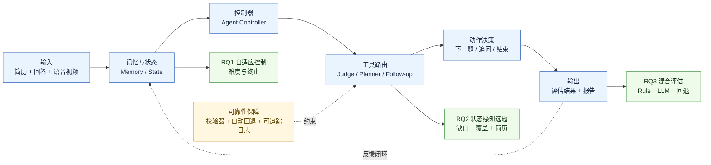

# AI 面试系统论文说明（当前版本）

本文档用于说明 `interview/paper/main.tex` 当前是如何写的，以及系统设计、算法实现和实验评估在代码中的落点。目标是让你和协作者用一份文档完成三件事：写论文、对实现、做评估。

## 1. 论文定位与一句话版本

- 论文定位：**memory-aware + tool-augmented + reliability-constrained 的 agentic interview framework**。
- 问题定义：把技术面试建模为“有限题量、观测不完整、评估信号不稳定”下的**序列决策问题**。
- 核心闭环（论文 Eq. `eq:agentic_loop`）：`observation -> memory -> state -> policy -> action -> tool use -> feedback -> memory/state update`。
- 关键约束：不是开放式自治智能体，而是**受限动作空间**与**可审计控制逻辑**。

## 2. 论文主线怎么写

### 2.1 三个研究问题（RQ）

- **RQ1**：如何在有限问题预算内做状态感知难度校准与终止控制，并在 4–5 题内收敛。
- **RQ2**：如何做状态条件化选题，统一知识缺口、简历先验、覆盖率和评估反馈。
- **RQ3**：如何做可靠性约束的混合评审（rule + LLM），包含路由、验证、回退和可选多评审聚合。

### 2.2 五个贡献（C1–C5）

- **C1**：Memory-aware agentic 框架（OMPA 闭环）。
- **C2**：自适应控制（难度更新 + 终止策略）。
- **C3**：状态感知选题（含 LLM topic planner + priority cascade）。
- **C4**：可靠性约束混合评审（routing/validation/fallback/multi-judge）。
- **C5**：工具化架构（含 topic planner 与多步 agentic report）。

## 3. 系统总体架构（论文 Section `sec:implementation`）

论文把实现映射为三层：

- **展示层（Streamlit）**：采集观测（文本/语音/视频）、展示题目与报告。
- **业务层（Python services）**：实现 controller、tool router、各工具模块。
- **数据层（SQLAlchemy + SQLite/MySQL）**：持久化会话、题目、评分、报告与记忆状态。

架构关键词：

- **Controller**：做动作决策。
- **Tool Router**：把动作分发到专用工具。
- **Action Space**：`ask-next / follow-up / terminate`。
- **Graceful Degradation**：LLM 不可用时可自动回退，保证流程不中断。

### 3.1 端到端执行链路（从页面到数据库）

建议把论文里的“系统架构图”对应到下面这条实现链：

1) 前端页面采集候选人输入（文本/语音/视频）并提交。  
2) `interview_engine` 写入会话轮次并构建当前观测。  
3) 评估路由执行 rule/LLM/hybrid，得到结构化评分与 `missing_points`。  
4) memory/state 模块更新跨轮状态。  
5) controller 决策动作：`follow-up` 或 `ask-next` 或 `terminate`。  
6) 题目/追问生成后写回数据库，并返回 UI 渲染。  
7) 会话结束后报告模块读取全量轨迹生成可解释结果。  

这条链路对应论文的 OMPA 闭环，可作为 implementation 小节的文字主干。

### 3.2 论文概念到代码模块映射（精简）

- **OMPA 闭环入口**：`backend/services/interview_engine.py`
- **Agent Controller 与动作决策**：`backend/agent/controller.py`
- **Memory/State 构建**：`backend/agent/memory.py`、`backend/agent/state_builder.py`
- **选题器（含 LLM topic planner）**：`backend/services/question_selector.py`
- **混合评审**：`backend/services/evaluator_rules.py`、`backend/services/llm_provider.py`、`backend/agent/judge_router.py`
- **追问规划**：`backend/agent/followup_planner.py`、`backend/services/interview_phrases.py`
- **报告生成**：`backend/services/report_generator.py`

写作时建议每个方法子节末尾加一句“代码主模块位于 xxx”，便于审稿和答辩时快速核对。

### 3.3 可靠性与回退矩阵（建议写进实现小节）

- **LLM judge 不可用**：回退到 rule judge，流程继续。
- **LLM follow-up 不可用**：回退模板追问或直接下一题。
- **LLM topic planner 不可用**：回退 priority cascade 选题。
- **多模态工具不可用**：降级为文本主流程，不影响主面试闭环。

建议在论文里显式报告“触发回退后的成功完成率（uptime）”，体现系统工程可靠性。

## 4. 数据流与状态定义（论文 Section `sec:method`）

### 4.1 Observation

每轮观测 `o_t = (q_t, y_t, e_t)`：

- `q_t`：当前问题（含难度和章节）
- `y_t`：候选人回答（文本或语音转写）
- `e_t`：评估输出（五维分数、overall、missing points、next-direction hint）

### 4.2 Interview Memory

记忆 `m_t` 不是单一历史文本，而是结构化累积状态，包含：

- 交互历史 `H_t`
- 分数历史 `S_t`
- 难度轨迹 `D_t`
- 章节覆盖 `C_t`
- 知识缺口集合 `M_t`
- 简历先验 `R`
- 追问轨迹 `F_t`
- 评估方向提示序列 `E_t`

每轮执行 `Update(m_t, o_t)` 写回记忆。

### 4.3 State Representation

控制器使用压缩状态 `s_t = (d_t, C_t, M_t, R, E_t, B_t)`，其中：

- `d_t`：当前难度估计
- `C_t`：覆盖状态
- `M_t`：知识缺口状态
- `R`：简历先验
- `E_t`：最近评估信号（含 next-direction）
- `B_t`：剩余预算与终止条件

## 5. 核心算法怎么写

### 5.1 RQ1：Adaptive Control（Section `sec:adaptive_control`）

目标：在预算约束下尽快稳定难度，并决定何时终止。

机制：

- **自适应回合上下界**：由用户 rounds 推导 `n_min`/`n_max`。
- **滑窗聚合**：计算全局均值、滑窗均值、标准差。
- **四类终止条件**：
  - 高分稳定提前结束
  - 持续低分提前结束
  - 覆盖与稳定性满足后正常结束
  - 预算耗尽强制结束
- **趋势感知难度更新**：
  - heuristic 规则策略
  - target-score-control（以目标分为控制点）

论文中给出了对应伪代码（Algorithm `alg:rq1`）。

### 5.2 RQ2：State-Aware Selection（Section `sec:selection`）

目标：在“补缺口、保覆盖、看简历、跟评估提示”的多目标下选下一题。

论文给出目标函数（Eq. `eq:selection_objective`），实现上采用：

- **Priority 0（有 LLM 时）**：LLM-as-topic-planner 先建议下一章；
  - 建议需通过章节集合校验与模糊匹配。
- **回退级联**：
  - Priority 1：缺口驱动（含 next-direction feedback 注入）
  - Priority 2：简历先验匹配
  - Priority 3：覆盖驱动探索（可 weighted random / Thompson / UCB）
- **个性化模式**：
  - IRT-inspired ability estimation（Eq. `eq:ability`）
  - Fisher 信息 + UCB + 个性化权重综合评分

### 5.3 Follow-up Planning（Section `sec:followup`）

动作不是默认进入下一题，而是先判断是否追问：

- 条件：分数区间、missing points、是否重复追问、每题追问预算上限。
- 生成：
  - LLM 可用：上下文追问生成
  - LLM 不可用：模板追问回退

对应伪代码：Algorithm `alg:followup`。

### 5.4 RQ3：Hybrid Judging（Section `sec:hybrid_judging`）

目标：兼顾语义理解能力与评分稳定性。

管线：

- Rule-based judge（五维确定性评分）
- LLM judge（结构化 rubric 输出）
- Validator/Critic（字段与分数范围校验）
- Fallback Router（异常/不可用时回退 rule）
- Optional Multi-Judge Aggregation（`J>1` 时聚合）

对应伪代码：Algorithm `alg:rq3`。

### 5.5 算法实现细节（建议新增到论文实现段）

为了避免“只有公式没有落地”，建议补充以下实现细节口径：

- **输入标准化**：短回答/无效回答先过质量门控，再进入评估器。
- **结构化输出约束**：LLM 输出必须满足字段和范围校验，不满足则拒收并回退。
- **动作预算约束**：每题追问次数、总题量上限、最小轮次下限由配置统一控制。
- **状态压缩频率**：每轮评估后更新 memory/state，避免跨轮信号丢失。
- **可追踪性**：每轮记录 `provenance`（rule/llm/fallback），用于后续审计与统计。

论文写法建议：这部分放在公式后，用“机制 + 工程约束”结构，避免被质疑不可复现。

## 6. 工具化模块清单（Section `sec:tools`）

论文工具表（Table `tab:tools`）的核心映射：

- Rule-based scorer（恒可用）
- LLM judge（可回退 rule）
- Validator/critic（失败即拒收并回退）
- Follow-up generator（可回退模板）
- Resume parser（不可用则无个性化）
- Speech analyzer / Expression analyzer（辅助信号，可降级）
- Report synthesizer（多步 LLM，可回退规则报告）
- LLM topic planner（不可用则回退 priority cascade）

## 7. 关键参数与可配置项（Section `sec:implementation`）

来自 Table `tab:algorithm_parameters` 的关键参数：

- window size（默认 3）
- user rounds / min-max round ratio / round cap
- follow-up limit（默认 2）
- similarity threshold（默认 70%）
- excellent/poor/stability 阈值（0.85/0.4/0.15）
- selector strategy（`weighted_random` / `thompson_sampling` / `personalized`）
- LLM CoT toggle
- LLM multi-judge count

这些参数共同决定控制器、选题策略和评估稳定性。

### 7.1 Feature Flags 与实验开关（建议新增）

为了支持“同一代码、不同策略”的公平比较，建议在论文中说明开关控制：

- agent controller 开关（新架构 vs 传统路径）
- memory/state 开关（有无跨轮记忆）
- LLM judge 开关（rule-only vs hybrid）
- LLM topic planner 开关（planner vs priority fallback）
- follow-up LLM 开关（上下文追问 vs 模板追问）

这能直接支撑消融实验的可复现性描述。

## 8. 实验设计与结果口径（Section `sec:experiments` + `sec:results`）

### 8.0 评估数据来源与数据集构成（新增）

评估建议拆成三类数据源，并在论文中明确区分：

- **D1：真实面试日志（Primary）**
  - 来源：系统线上/线下真实会话（`InterviewSession`、`AskedQuestion`、`Evaluation`、`Report`）。
  - 作用：验证系统在真实交互噪声下的有效性与稳定性。
  - 记录粒度：每轮题目、回答文本/语音转写、评分结构、追问轨迹、终止轮次、模型可用性与回退标记。
- **D2：专家标注子集（Gold Slice）**
  - 来源：从 D1 抽样的题-答对，由人工评审按同一 rubric 打分并标记 missing points。
  - 作用：作为评估一致性的“参考真值”，用于计算 rule/LLM/hybrid 与人工的一致性。
  - 标注建议：双人标注 + 冲突仲裁，保留最终共识分数。
- **D3：可控回放/合成对照集（Controlled）**
  - 来源：固定题目和预设回答模板（高质量/中等/低质量/跑题/极短回答）构造的回放集。
  - 作用：做可重复消融与压力测试（例如禁用某模块、强制回退、替换选题策略）。
  - 注意：该数据只用于机制验证，论文中需明确其与真实数据结论分开报告。

论文写法建议：主结论优先基于 D1；一致性/校准细节由 D2 支撑；机制可重复性由 D3 支撑。

### 8.1 四条评估轴线

- RQ1：自适应控制有效性
- RQ2：状态感知选题质量
- RQ3：混合评审可靠性
- Memory-aware integration：跨轮记忆反馈对流程一致性的影响

### 8.2 主要指标

- Calibration error / calibration accuracy / convergence
- Gap targeting / coverage / personalization relevance
- Agreement（kappa/ICC）
- Uptime（含回退算成功）

### 8.3 真实数据评估怎么做（新增）

基于 D1 + D2 的推荐流程：

1) **样本构建**：按岗位方向、候选人层级、会话轮次数分层抽样，避免只在单一方向上评估。  
2) **在线日志清洗**：去掉空轮次、异常中断轮次，保留回退标记（用于可靠性统计）。  
3) **人工标注对齐（D2）**：从真实样本中抽取子集，使用同一五维 rubric 标注。  
4) **系统对比**：分别运行 rule-only、LLM-only（可选）、hybrid（论文主方法）并输出结构化评分。  
5) **统计分析**：
   - 评分一致性：`kappa/ICC`（系统 vs 人工）
   - 过程指标：平均轮次、提前终止率、追问触发率、回退率
   - 结果指标：覆盖率、缺口命中率、个性化相关度
6) **分组报告**：按岗位/层级/是否触发回退分组，检查结论是否稳定。

建议在论文中把“真实数据评估”作为主实验段落，把 D3 结果放在消融或附录。

### 8.4 系统模块评估包括哪些、怎么做（新增）

模块评估建议按“输入-输出-指标-失败模式”四元组组织：

- **M1 Adaptive Control（难度与终止）**
  - 输入：轮次分数流、覆盖状态、预算参数。
  - 输出：难度轨迹、终止决策、终止轮次。
  - 指标：收敛轮次、过早终止率、过晚终止率、稳定区间命中率。
  - 做法：在 D3 上做可控回放，在 D1 上报告真实分布。
- **M2 Question Selector（状态感知选题）**
  - 输入：缺口集合、章节覆盖、简历先验、next-direction。
  - 输出：下一题章节/题目、策略来源（LLM planner 或 priority fallback）。
  - 指标：gap targeting 命中率、覆盖提升、重复题率、简历相关度。
  - 做法：比较 `weighted_random/thompson/personalized`，并做去除 resume/gap/next-direction 的消融。
- **M3 Follow-up Planner（追问）**
  - 输入：当前题评估结果、missing points、追问预算、历史追问轨迹。
  - 输出：是否追问、追问文本、追问次数。
  - 指标：追问有效率（是否补到缺口）、重复追问率、追问后分数提升。
  - 做法：对比“无追问/模板追问/LLM上下文追问”。
- **M4 Hybrid Judging（规则+LLM+回退）**
  - 输入：题目、回答、rubric、模型可用性状态。
  - 输出：结构化分数、missing points、provenance、回退标记。
  - 指标：与人工一致性、评分方差、非法输出率、回退成功率、端到端 uptime。
  - 做法：在 D2 上算一致性，在 D1 上算稳定性与可用性。
- **M5 Memory/State Integration（记忆与状态压缩）**
  - 输入：历史轮次观测与评估序列。
  - 输出：压缩状态（`d_t, C_t, M_t, R, E_t, B_t`）与后续动作决策。
  - 指标：跨轮一致性、动作抖动率（频繁改策略）、信息利用率（next-direction 被采纳比例）。
  - 做法：与“无记忆/短记忆”版本对比，观察流程稳定性与选题质量差异。

写作建议：模块评估不追求“每个模块都 SOTA”，重点证明“组合后闭环系统”在真实场景更稳、更可解释。

### 8.5 基线与消融

- 基线：固定模板、随机选题、仅规则评估
- 消融：去简历先验、去 gap targeting、去 next-direction、去 follow-up、去 routing/fallback、去 memory feedback、去 multi-judge、控制策略/选题策略替换

### 8.6 评估执行细节（可直接写进实验方法）

建议固定如下 protocol，保证真实数据评估可复现：

1) **数据切分**：按会话维度切分 train/dev/test，避免同一候选人跨集合泄漏。  
2) **时间切分补充**：可增加按时间窗口切分，验证模型/策略在时序漂移下的稳健性。  
3) **随机性控制**：固定随机种子，记录 selector 策略与参数。  
4) **统计显著性**：对关键指标报告均值、标准差与置信区间；必要时做配对检验。  
5) **失败案例分析**：分别列出“评分偏差大”“追问重复”“选题跳跃”三类失败样本。  
6) **伦理与隐私**：真实数据匿名化，移除个人可识别信息，仅保留评估相关字段。

### 8.7 结果呈现模板（建议）

论文结果部分建议至少包含 4 张核心表：

- **T1 总体效果表**：RQ1/RQ2/RQ3 主指标横向对比（baseline vs hybrid）。
- **T2 模块消融表**：去掉关键模块后的指标下降幅度。
- **T3 可靠性表**：回退触发率、回退成功率、端到端 uptime。
- **T4 一致性表**：系统与专家标注的一致性（kappa/ICC）分层统计。

并配 1 张案例图：展示“候选人回答 -> 评估 -> 追问/下一题 -> 终止”的完整轨迹。

## 9. 写作与协作建议

### 9.1 保持“机制-实现-证据”对齐

写法建议每节都用同一结构：

1) 机制定义（公式/流程）  
2) 实现约束（工具、回退、参数）  
3) 证据口径（实验指标/结果/消融）

### 9.2 避免超范围 claim

- 若某结果是占位或模拟数据，明确标注（当前论文中已有对应说明）。
- “已实现”与“可扩展/原型”分开写。

### 9.3 后续优先补强点

- 真实数据替换 illustrative 数字
- 对应图表截图与复现脚本引用一致性
- Results 与 Discussion 的“限制与边界条件”进一步收敛

### 9.4 一页式自检清单（投稿/答辩前）

- 每个 RQ 是否都有“机制、实现、指标、结果”四件套？
- 每个贡献点是否能在代码中定位到模块与配置？
- 每个关键结果是否说明了数据来源（D1/D2/D3）？
- 所有 “LLM 增益” 是否同时报告了回退与失败案例？
- 论文中的数值、图表、复现脚本是否可一一对应？

## 10. 导师汇报一眼图（可直接展示）

> 说明：这张图用于 10-20 秒讲清系统“怎么做的”。你可以直接在 Markdown 中展示，或截图放进 PPT。

**汇报口径（照读即可）**：
1) 主链路是“输入 -> 状态 -> 控制器 -> 工具 -> 动作 -> 输出”。  
2) 三个研究问题分别对应控制、选题和评估。  
3) 右侧可靠性约束说明：即使 LLM 波动，系统也可校验并回退，保证流程可用。  

---

如果你愿意，我下一步可以继续给你生成一版“导师汇报口径”的 2 页精简版（更偏叙述），以及一版“代码对照口径”的附录（偏工程实现与模块映射）。

