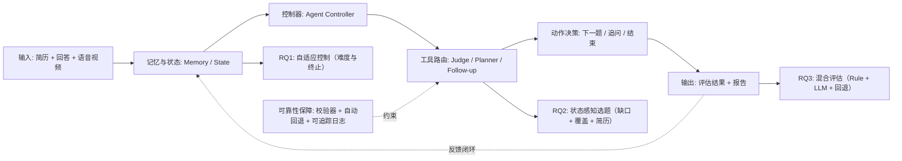

# AI 面试系统论文说明（当前版本）

本文档用于说明 `interview/paper/main.tex` 当前是如何写的，以及系统设计、算法实现和实验评估在代码中的落点。目标是让你和协作者用一份文档完成三件事：写论文、对实现、做评估。

## 1. 论文定位与一句话版本

- 论文定位：**memory-aware + tool-augmented + reliability-constrained 的 agentic interview framework**。
- 问题定义：把技术面试建模为“有限题量、观测不完整、评估信号不稳定”下的**序列决策问题**。
- 核心闭环（论文 Eq. `eq:agentic_loop`）：`observation -> memory -> state -> policy -> action -> tool use -> feedback -> memory/state update`。
- 关键约束：不是开放式自治智能体，而是**受限动作空间**与**可审计控制逻辑**。

## 2. 论文主线怎么写

### 2.1 三个研究问题（RQ）

- **RQ1**：如何在有限问题预算内做状态感知难度校准与终止控制，并在 4–5 题内收敛。
- **RQ2**：如何做状态条件化选题，统一知识缺口、简历先验、覆盖率和评估反馈。
- **RQ3**：如何做可靠性约束的混合评审（rule + LLM），包含路由、验证、回退和可选多评审聚合。

### 2.2 五个贡献（C1–C5）

- **C1**：Memory-aware agentic 框架（OMPA 闭环）。
- **C2**：自适应控制（难度更新 + 终止策略）。
- **C3**：状态感知选题（含 LLM topic planner + priority cascade）。
- **C4**：可靠性约束混合评审（routing/validation/fallback/multi-judge）。
- **C5**：工具化架构（含 topic planner 与多步 agentic report）。

## 3. 系统总体架构（论文 Section `sec:implementation`）

论文把实现映射为三层：

- **展示层（Streamlit）**：采集观测（文本/语音/视频）、展示题目与报告。
- **业务层（Python services）**：实现 controller、tool router、各工具模块。
- **数据层（SQLAlchemy + SQLite/MySQL）**：持久化会话、题目、评分、报告与记忆状态。

架构关键词：

- **Controller**：做动作决策。
- **Tool Router**：把动作分发到专用工具。
- **Action Space**：`ask-next / follow-up / terminate`。
- **Graceful Degradation**：LLM 不可用时可自动回退，保证流程不中断。

### 3.1 端到端执行链路（从页面到数据库）

建议把论文里的“系统架构图”对应到下面这条实现链：

1) 前端页面采集候选人输入（文本/语音/视频）并提交。  
2) `interview_engine` 写入会话轮次并构建当前观测。  
3) 评估路由执行 rule/LLM/hybrid，得到结构化评分与 `missing_points`。  
4) memory/state 模块更新跨轮状态。  
5) controller 决策动作：`follow-up` 或 `ask-next` 或 `terminate`。  
6) 题目/追问生成后写回数据库，并返回 UI 渲染。  
7) 会话结束后报告模块读取全量轨迹生成可解释结果。  

这条链路对应论文的 OMPA 闭环，可作为 implementation 小节的文字主干。

### 3.2 论文概念到代码模块映射（精简）

- **OMPA 闭环入口**：`backend/services/interview_engine.py`
- **Agent Controller 与动作决策**：`backend/agent/controller.py`
- **Memory/State 构建**：`backend/agent/memory.py`、`backend/agent/state_builder.py`
- **选题器（含 LLM topic planner）**：`backend/services/question_selector.py`
- **混合评审**：`backend/services/evaluator_rules.py`、`backend/services/llm_provider.py`、`backend/agent/judge_router.py`
- **追问规划**：`backend/agent/followup_planner.py`、`backend/services/interview_phrases.py`
- **报告生成**：`backend/services/report_generator.py`

写作时建议每个方法子节末尾加一句“代码主模块位于 xxx”，便于审稿和答辩时快速核对。

函数级锚点（答辩时可直接点名）：

- `interview_engine.start_interview(...)`：初始化会话与首题（可含简历先验）。
- `interview_engine.submit_answer(...)`：单轮主入口，串起评估、状态更新、动作执行。
- `question_selector.select_question(...)`：下一题选择（含 priority cascade）。
- `llm_provider.evaluate_with_llm(...)`：LLM 评分入口。
- `llm_provider.generate_followup_with_context(...)`：上下文追问生成。
- `llm_provider.generate_deep_report_analysis(...)`：多步报告分析生成。
- `agent.controller.AgentController`：agentic 路径下的策略与工具编排核心。

### 3.3 可靠性与回退矩阵（建议写进实现小节）

- **LLM judge 不可用**：回退到 rule judge，流程继续。
- **LLM follow-up 不可用**：回退模板追问或直接下一题。
- **LLM topic planner 不可用**：回退 priority cascade 选题。
- **多模态工具不可用**：降级为文本主流程，不影响主面试闭环。

建议在论文里显式报告“触发回退后的成功完成率（uptime）”，体现系统工程可靠性。

## 4. 数据流与状态定义（论文 Section `sec:method`）

### 4.1 Observation

每轮观测 `o_t = (q_t, y_t, e_t)`：

- `q_t`：当前问题（含难度和章节）
- `y_t`：候选人回答（文本或语音转写）
- `e_t`：评估输出（五维分数、overall、missing points、next-direction hint）

### 4.2 Interview Memory

记忆 `m_t` 不是单一历史文本，而是结构化累积状态，包含：

- 交互历史 `H_t`
- 分数历史 `S_t`
- 难度轨迹 `D_t`
- 章节覆盖 `C_t`
- 知识缺口集合 `M_t`
- 简历先验 `R`
- 追问轨迹 `F_t`
- 评估方向提示序列 `E_t`

每轮执行 `Update(m_t, o_t)` 写回记忆。

### 4.3 State Representation

控制器使用压缩状态 `s_t = (d_t, C_t, M_t, R, E_t, B_t)`，其中：

- `d_t`：当前难度估计
- `C_t`：覆盖状态
- `M_t`：知识缺口状态
- `R`：简历先验
- `E_t`：最近评估信号（含 next-direction）
- `B_t`：剩余预算与终止条件

## 5. 核心算法怎么写

### 5.1 RQ1：Adaptive Control（Section `sec:adaptive_control`）

目标：在预算约束下尽快稳定难度，并决定何时终止。

机制：

- **自适应回合上下界**：由用户 rounds 推导 `n_min`/`n_max`。
- **滑窗聚合**：计算全局均值、滑窗均值、标准差。
- **四类终止条件**：
  - 高分稳定提前结束
  - 持续低分提前结束
  - 覆盖与稳定性满足后正常结束
  - 预算耗尽强制结束
- **趋势感知难度更新**：
  - heuristic 规则策略
  - target-score-control（以目标分为控制点）

论文中给出了对应伪代码（Algorithm `alg:rq1`）。

### 5.2 RQ2：State-Aware Selection（Section `sec:selection`）

目标：在“补缺口、保覆盖、看简历、跟评估提示”的多目标下选下一题。

论文给出目标函数（Eq. `eq:selection_objective`），实现上采用：

- **Priority 0（有 LLM 时）**：LLM-as-topic-planner 先建议下一章；
  - 建议需通过章节集合校验与模糊匹配。
- **回退级联**：
  - Priority 1：缺口驱动（含 next-direction feedback 注入）
  - Priority 2：简历先验匹配
  - Priority 3：覆盖驱动探索（可 weighted random / Thompson / UCB）
- **个性化模式**：
  - IRT-inspired ability estimation（Eq. `eq:ability`）
  - Fisher 信息 + UCB + 个性化权重综合评分

### 5.3 Follow-up Planning（Section `sec:followup`）

动作不是默认进入下一题，而是先判断是否追问：

- 条件：分数区间、missing points、是否重复追问、每题追问预算上限。
- 生成：
  - LLM 可用：上下文追问生成
  - LLM 不可用：模板追问回退

对应伪代码：Algorithm `alg:followup`。

### 5.4 RQ3：Hybrid Judging（Section `sec:hybrid_judging`）

目标：兼顾语义理解能力与评分稳定性。

管线：

- Rule-based judge（五维确定性评分）
- LLM judge（结构化 rubric 输出）
- Validator/Critic（字段与分数范围校验）
- Fallback Router（异常/不可用时回退 rule）
- Optional Multi-Judge Aggregation（`J>1` 时聚合）

对应伪代码：Algorithm `alg:rq3`。

### 5.5 算法实现细节（建议新增到论文实现段）

为了避免“只有公式没有落地”，建议补充以下实现细节口径：

- **输入标准化**：短回答/无效回答先过质量门控，再进入评估器。
- **结构化输出约束**：LLM 输出必须满足字段和范围校验，不满足则拒收并回退。
- **动作预算约束**：每题追问次数、总题量上限、最小轮次下限由配置统一控制。
- **状态压缩频率**：每轮评估后更新 memory/state，避免跨轮信号丢失。
- **可追踪性**：每轮记录 `provenance`（rule/llm/fallback），用于后续审计与统计。

论文写法建议：这部分放在公式后，用“机制 + 工程约束”结构，避免被质疑不可复现。

## 6. 工具化模块清单（Section `sec:tools`）

论文工具表（Table `tab:tools`）的核心映射：

- Rule-based scorer（恒可用）
- LLM judge（可回退 rule）
- Validator/critic（失败即拒收并回退）
- Follow-up generator（可回退模板）
- Resume parser（不可用则无个性化）
- Speech analyzer / Expression analyzer（辅助信号，可降级）
- Report synthesizer（多步 LLM，可回退规则报告）
- LLM topic planner（不可用则回退 priority cascade）

## 7. 关键参数与可配置项（Section `sec:implementation`）

来自 Table `tab:algorithm_parameters` 的关键参数：

- window size（默认 3）
- user rounds / min-max round ratio / round cap
- follow-up limit（默认 2）
- similarity threshold（默认 70%）
- excellent/poor/stability 阈值（0.85/0.4/0.15）
- selector strategy（`weighted_random` / `thompson_sampling` / `personalized`）
- LLM CoT toggle
- LLM multi-judge count

这些参数共同决定控制器、选题策略和评估稳定性。

### 7.1 Feature Flags 与实验开关（建议新增）

为了支持“同一代码、不同策略”的公平比较，建议在论文中说明开关控制：

- agent controller 开关（新架构 vs 传统路径）
- memory/state 开关（有无跨轮记忆）
- LLM judge 开关（rule-only vs hybrid）
- LLM topic planner 开关（planner vs priority fallback）
- follow-up LLM 开关（上下文追问 vs 模板追问）

这能直接支撑消融实验的可复现性描述。

## 8. 实验设计与结果口径（Section `sec:experiments` + `sec:results`）

### 8.0 评估数据来源与数据集构成（新增）

先给出与 `main.tex` 的一致性口径（必须在汇报时说清）：

- **Current（当前论文已报告）**：`main.tex` 结果章节当前基于 reproduction pipeline 的 synthetic 数据（80 sessions, 20 participants, seed=42）。
- **Next-step（下一阶段补强）**：真实面试日志评估（D1）和专家标注子集（D2）作为后续实证扩展。

在此基础上，评估数据可拆成三类来源，并在论文中明确区分：

- **D1：真实面试日志（Primary）**
  - 来源：系统线上/线下真实会话（`InterviewSession`、`AskedQuestion`、`Evaluation`、`Report`）。
  - 作用：验证系统在真实交互噪声下的有效性与稳定性。
  - 记录粒度：每轮题目、回答文本/语音转写、评分结构、追问轨迹、终止轮次、模型可用性与回退标记。
- **D2：专家标注子集（Gold Slice）**
  - 来源：从 D1 抽样的题-答对，由人工评审按同一 rubric 打分并标记 missing points。
  - 作用：作为评估一致性的“参考真值”，用于计算 rule/LLM/hybrid 与人工的一致性。
  - 标注建议：双人标注 + 冲突仲裁，保留最终共识分数。
- **D3：可控回放/合成对照集（Controlled）**
  - 来源：固定题目和预设回答模板（高质量/中等/低质量/跑题/极短回答）构造的回放集。
  - 作用：做可重复消融与压力测试（例如禁用某模块、强制回退、替换选题策略）。
  - 注意：该数据只用于机制验证，论文中需明确其与真实数据结论分开报告。

论文写法建议（与当前稿件一致）：  
当前版本主结果使用 D3/reproduction 口径；真实部署价值由 D1+D2 的 protocol 与后续实验补强。

### 8.1 四条评估轴线

- RQ1：自适应控制有效性
- RQ2：状态感知选题质量
- RQ3：混合评审可靠性
- Memory-aware integration：跨轮记忆反馈对流程一致性的影响

### 8.2 主要指标

- Calibration error / calibration accuracy / convergence
- Gap targeting / coverage / personalization relevance
- Agreement（kappa/ICC）
- Uptime（含回退算成功）

### 8.3 真实数据评估怎么做（Next-step protocol）

基于 D1 + D2 的推荐流程：

1) **样本构建**：按岗位方向、候选人层级、会话轮次数分层抽样，避免只在单一方向上评估。  
2) **在线日志清洗**：去掉空轮次、异常中断轮次，保留回退标记（用于可靠性统计）。  
3) **人工标注对齐（D2）**：从真实样本中抽取子集，使用同一五维 rubric 标注。  
4) **系统对比**：分别运行 rule-only、LLM-only（可选）、hybrid（论文主方法）并输出结构化评分。  
5) **统计分析**：
   - 评分一致性：`kappa/ICC`（系统 vs 人工）
   - 过程指标：平均轮次、提前终止率、追问触发率、回退率
   - 结果指标：覆盖率、缺口命中率、个性化相关度
6) **分组报告**：按岗位/层级/是否触发回退分组，检查结论是否稳定。

建议在下一版论文中把“真实数据评估”升级为主实验段落；当前版本保持 D3/reproduction 结果为主，并显式标注边界。

### 8.4 系统模块评估包括哪些、怎么做（新增）

模块评估建议按“输入-输出-指标-失败模式”四元组组织：

- **M1 Adaptive Control（难度与终止）**
  - 输入：轮次分数流、覆盖状态、预算参数。
  - 输出：难度轨迹、终止决策、终止轮次。
  - 指标：收敛轮次、过早终止率、过晚终止率、稳定区间命中率。
  - 做法：在 D3 上做可控回放，在 D1 上报告真实分布。
- **M2 Question Selector（状态感知选题）**
  - 输入：缺口集合、章节覆盖、简历先验、next-direction。
  - 输出：下一题章节/题目、策略来源（LLM planner 或 priority fallback）。
  - 指标：gap targeting 命中率、覆盖提升、重复题率、简历相关度。
  - 做法：比较 `weighted_random/thompson/personalized`，并做去除 resume/gap/next-direction 的消融。
- **M3 Follow-up Planner（追问）**
  - 输入：当前题评估结果、missing points、追问预算、历史追问轨迹。
  - 输出：是否追问、追问文本、追问次数。
  - 指标：追问有效率（是否补到缺口）、重复追问率、追问后分数提升。
  - 做法：对比“无追问/模板追问/LLM上下文追问”。
- **M4 Hybrid Judging（规则+LLM+回退）**
  - 输入：题目、回答、rubric、模型可用性状态。
  - 输出：结构化分数、missing points、provenance、回退标记。
  - 指标：与人工一致性、评分方差、非法输出率、回退成功率、端到端 uptime。
  - 做法：在 D2 上算一致性，在 D1 上算稳定性与可用性。
- **M5 Memory/State Integration（记忆与状态压缩）**
  - 输入：历史轮次观测与评估序列。
  - 输出：压缩状态（`d_t, C_t, M_t, R, E_t, B_t`）与后续动作决策。
  - 指标：跨轮一致性、动作抖动率（频繁改策略）、信息利用率（next-direction 被采纳比例）。
  - 做法：与“无记忆/短记忆”版本对比，观察流程稳定性与选题质量差异。

写作建议：模块评估不追求“每个模块都 SOTA”，重点证明“组合后闭环系统”在真实场景更稳、更可解释。

### 8.5 基线与消融

- 基线：固定模板、随机选题、仅规则评估
- 消融：去简历先验、去 gap targeting、去 next-direction、去 follow-up、去 routing/fallback、去 memory feedback、去 multi-judge、控制策略/选题策略替换

### 8.6 评估执行细节（可直接写进实验方法）

建议固定如下 protocol，保证真实数据评估可复现：

1) **数据切分**：按会话维度切分 train/dev/test，避免同一候选人跨集合泄漏。  
2) **时间切分补充**：可增加按时间窗口切分，验证模型/策略在时序漂移下的稳健性。  
3) **随机性控制**：固定随机种子，记录 selector 策略与参数。  
4) **统计显著性**：对关键指标报告均值、标准差与置信区间；必要时做配对检验。  
5) **失败案例分析**：分别列出“评分偏差大”“追问重复”“选题跳跃”三类失败样本。  
6) **伦理与隐私**：真实数据匿名化，移除个人可识别信息，仅保留评估相关字段。

### 8.7 结果呈现模板（建议）

论文结果部分建议至少包含 4 张核心表：

- **T1 总体效果表**：RQ1/RQ2/RQ3 主指标横向对比（baseline vs hybrid）。
- **T2 模块消融表**：去掉关键模块后的指标下降幅度。
- **T3 可靠性表**：回退触发率、回退成功率、端到端 uptime。
- **T4 一致性表**：系统与专家标注的一致性（kappa/ICC）分层统计。

并配 1 张案例图：展示“候选人回答 -> 评估 -> 追问/下一题 -> 终止”的完整轨迹。

### 8.8 最小可执行评估清单（落地版）

一次完整实验建议按以下 4 步执行，并产出固定交付物：

1) **数据准备**
   - 导出会话级数据（题目、回答、评分、追问、终止、回退标记）。
   - 生成 D2 标注子集（双人标注 + 冲突仲裁）。
2) **运行评估**
   - 跑 baseline（rule-only）与主方法（hybrid）。
   - 跑关键消融（去 memory / 去 follow-up / 去 fallback / 去 planner）。
3) **统计汇总**
   - 计算 RQ1/RQ2/RQ3 主指标与置信区间。
   - 生成分组统计（岗位、层级、是否触发回退）。
4) **汇报交付**
   - **T1 总体效果表**
   - **T2 模块消融表**
   - **T3 可靠性表**
   - **T4 一致性表**
   - **Case Study**：至少 3 条失败样本（评分偏差、追问重复、选题跳跃）+ 解释

## 9. 写作与协作建议

### 9.1 保持“机制-实现-证据”对齐

写法建议每节都用同一结构：

1) 机制定义（公式/流程）  
2) 实现约束（工具、回退、参数）  
3) 证据口径（实验指标/结果/消融）

### 9.2 避免超范围 claim

- 若某结果是占位或模拟数据，明确标注（当前论文中已有对应说明）。
- “已实现”与“可扩展/原型”分开写。

### 9.3 后续优先补强点

- 真实数据替换 illustrative 数字
- 对应图表截图与复现脚本引用一致性
- Results 与 Discussion 的“限制与边界条件”进一步收敛

### 9.4 一页式自检清单（投稿/答辩前）

- 每个 RQ 是否都有“机制、实现、指标、结果”四件套？
- 每个贡献点是否能在代码中定位到模块与配置？
- 每个关键结果是否说明了数据来源（D1/D2/D3）？
- 所有 “LLM 增益” 是否同时报告了回退与失败案例？
- 论文中的数值、图表、复现脚本是否可一一对应？

## 10. 导师汇报一眼图（可直接展示）

> 说明：这张图用于 10-20 秒讲清系统“怎么做的”。你可以直接在 Markdown 中展示，或截图放进 PPT。

**汇报口径（照读即可）**：
1) 主链路是“输入 -> 状态 -> 控制器 -> 工具 -> 动作 -> 输出”。  
2) 三个研究问题分别对应控制、选题和评估。  
3) 右侧可靠性约束说明：即使 LLM 波动，系统也可校验并回退，保证流程可用。  

**30 秒版讲稿**：  
“这套系统不是让大模型自由发挥，而是一个受限动作的闭环控制系统。每轮先把输入更新到记忆和状态，再由控制器选择下一步动作，通过工具路由调用评估、选题和追问模块，最后输出下一题或结束并生成报告。下排三块分别对应 RQ1、RQ2、RQ3。右侧这条可靠性约束是关键：任何 LLM 不稳定都能被校验并自动回退，所以系统在真实使用中是可持续运行的。”  

## 11. 导师汇报讲稿模板（可直接照读）

### 11.1 三分钟版（快节奏）

“老师好，我这项工作聚焦一个核心问题：技术面试中，题量有限、候选人能力不可直接观测、评估信号也不稳定，怎么做到高质量且可复现的自适应面试。

我们的解法不是让大模型端到端自由生成，而是把流程建模成受限动作的闭环系统：`Observation -> Memory -> State -> Policy -> Action`。  
动作空间只有三个：下一题、追问、结束。这样做的好处是控制逻辑可审计、可回放、可复现。

系统层面是三层：前端采集和展示，业务层做控制和工具编排，数据层持久化全流程。  
算法上对应三个研究问题：  
RQ1 做难度与终止控制，目标是在 4-5 题内稳定收敛；  
RQ2 做状态感知选题，把知识缺口、覆盖率、简历先验和评估反馈统一起来；  
RQ3 做混合评审，把 rule 的稳定性和 LLM 的语义理解结合，并通过校验和回退保证可靠性。

评估方面，当前论文结果口径与 `main.tex` 一致，主结果来自 reproduction 的 synthetic 数据；同时我们给了真实数据评估 protocol，下一步会用真实日志和专家标注子集做一致性和鲁棒性验证。  
核心结论是：这个框架在保持工程可靠性的前提下，实现了更智能的选题和更稳健的评估。”

### 11.2 八分钟版（结构化）

#### A. 背景与目标（1 分钟）

“当前面试系统常见两类问题：  
一类是规则系统，稳定但理解浅；  
一类是纯 LLM 系统，理解强但波动大。  
我们希望做一个折中且可落地的方案：既要智能，也要稳定，还要可复现。”

#### B. 方法总览（2 分钟）

“方法主线是 memory-aware + tool-augmented + reliability-constrained。  
每轮先形成观测，再更新记忆，压缩成状态，由控制器选动作，再调用专用工具执行，最后把反馈写回记忆形成下一轮闭环。

这里最重要的是受限动作空间和工具路由：  
受限动作保证可控，工具路由保证可扩展，回退机制保证可用。”

#### C. 三个研究问题与实现（3 分钟）

“RQ1（Adaptive Control）：  
通过滑窗统计和预算约束做难度更新与终止判断，避免问太多或太少。  

RQ2（State-Aware Selection）：  
先尝试 LLM topic planner，失败则走 priority cascade，把 gap、resume、coverage、next-direction 综合起来选下一题。  

RQ3（Hybrid Judging）：  
rule judge 提供确定性基线，LLM judge 提供语义增强，validator 做结构校验，异常自动 fallback。  
所以系统不会因为单次 LLM 波动而中断。”

#### D. 评估设计与当前口径（1 分钟）

“实验按四条轴线：RQ1 控制有效性、RQ2 选题质量、RQ3 评估可靠性、以及 memory-aware 集成效应。  
当前版本结果基于 reproduction 的 synthetic 数据，这点在文稿里明确标注。  
同时文档给出了真实数据评估的落地流程：日志抽样、专家标注、系统对比、分组统计和失败案例分析。”

#### E. 价值与下一步（1 分钟）

“这个工作的价值是把‘智能性’和‘工程可靠性’统一到同一个框架里。  
下一步重点是用真实数据完成主实验替换，并对关键阈值和策略做更系统的敏感性验证。”

### 11.3 老师高频追问（快答版）

- **问：为什么不直接端到端用 LLM？**  
  答：端到端更灵活，但可控性和复现性差。我们用受限动作 + 工具路由，把关键决策结构化，便于审计和回退。

- **问：你现在结果是否全是实测真实数据？**  
  答：当前论文主结果口径是 reproduction 的 synthetic 数据；真实数据 protocol 已完整设计，下一阶段补主实验。

- **问：你们的创新点是不是工程堆叠？**  
  答：不是简单堆叠，核心是 OMPA 闭环建模和 reliability-constrained 机制，把控制、选题、评估统一在可验证框架内。

- **问：怎么证明系统可靠？**  
  答：看两类指标：一致性（kappa/ICC）和可用性（fallback 成功率、end-to-end uptime），并给失败案例做归因。

---

## 12. 模块算法与评估（易懂版，按面试系统顺序）

这一节专门解决“看不懂算法在做什么”的问题。  
每个模块都按同一结构写：**输入是什么 -> 核心怎么做 -> 失败时怎么回退 -> 怎么评估**。

### 12.1 会话初始化与首题生成

**输入**
- 用户选择的岗位方向（track）、初始难度、目标轮数
- 可选：简历解析结果（skills/projects/experience）

**核心怎么做**
1) 系统先创建会话（session）。  
2) 如果有简历且 LLM 可用，优先生成“和简历相关”的首题。  
3) 如果 LLM 不可用或生成失败，就从题库按难度和章节策略选第一题。  
4) 把首题写入数据库并发给前端。

**为什么这样设计**
- 首题决定候选人的“进入状态”和系统的“初始定位”。  
- 用简历先验能更快进入候选人熟悉语境，减少无效试探。

**失败时怎么回退**
- LLM 首题失败 -> 题库选题（主流程不断）。

**怎么评估**
- 个性化相关度（是否和简历/岗位相关）
- 首题可答性（是否过难过偏）
- 工程可用性（首题阶段失败是否影响流程）

---

### 12.2 Observation / Memory / State（每轮状态更新）

**输入**
- 当前题目 `q_t`
- 候选人回答 `y_t`（文本或语音转写）
- 评估结果 `e_t`（分数、缺失点、下一题提示）
- 可选：语音与表情分析信号

**核心怎么做**
1) **Observation**：把“这一轮发生了什么”结构化记录下来。  
2) **Memory**：把跨轮信息累积起来（分数轨迹、难度轨迹、章节覆盖、缺失点集合、追问次数、next-direction）。  
3) **State**：把 memory 压缩成可决策状态（当前难度、平均分、近窗分、波动、覆盖、剩余预算等）。

**为什么这样设计**
- 面试是序列决策，不是单轮问答。  
- 不保留跨轮信号就无法做“连续追踪式”选题和终止判断。

**失败时怎么回退**
- agentic 功能未开启时，走 legacy 路径；核心面试流程仍可执行。

**怎么评估**
- 跨轮一致性（动作是否稳定）
- 状态利用率（hint 和缺失点是否被后续选题用到）
- 过程可追踪性（每轮 provenance 可审计）

---

### 12.2.1 语音、视频与表情分析（辅助观测信号）

**输入**
- 语音：音频数据、时长、停顿信息、识别置信度、转写文本
- 表情：单帧图片或实时视频分析序列（多帧 `analyses`）

**核心怎么做**
1) **语音分析**  
   - 先做语音转写（ASR），再提取节奏特征：语速、停顿频率、平均停顿时长。  
   - 结合修正次数、置信度计算两类高层指标：`fluency` 与 `nervousness`。  
   - 这些指标不是替代知识评分，而是补充“表达状态”维度。
2) **表情分析**  
   - 用情绪识别模型输出情绪分布（happy/neutral/fear/sad 等）。  
   - 再映射成面试可解释信号：紧张度、自信度、投入度，以及建议文本。  
3) **实时视频模式**  
   - 每轮评估使用最近一帧结果；同时把多帧结果写入会话级历史。  
   - 报告阶段汇总全局趋势（如紧张度变化、主导情绪变化）。

**输出落点**
- 题目级：`speech_analysis_json`、`expression_analysis_json`
- 会话级：`expression_history_json`（用于报告期趋势分析）

**为什么这样设计**
- 面试不只有“答对/答错”，表达流畅度和临场状态也影响面试表现解释。  
- 采用“辅助信号”定位，避免多模态噪声破坏主流程稳定性。

**失败时怎么回退**
- 语音服务不可用：回到文本主流程。  
- 视频/表情不可用：跳过该信号，不影响评估、选题、终止和报告主链路。  
- 即：多模态永远是增强项，不是阻塞项。

**怎么评估**
- 语音模块：与人工紧张度/流畅度标注的相关性（Pearson 或 Spearman）
- 表情模块：标准 FER 数据集准确率 + 面试场景解释一致性
- 系统层：关闭多模态时端到端可用率（降级后 uptime）

---

### 12.3 回答评估（Rule / LLM / Hybrid + 校验 + 回退）

**输入**
- 题目、标准答案、候选人回答

**核心怎么做**
1) **Rule judge** 先给稳定基线分（五维 + overall）。  
2) 若 LLM 可用，再做语义评估（结构化 JSON 输出）。  
3) Validator 检查字段和分数范围是否合法。  
4) 合法则用 LLM/hybrid 结果；不合法或异常则回退 rule。

**为什么这样设计**
- 纯规则稳定但理解浅，纯 LLM理解强但波动大。  
- 混合路由的目标是“语义能力 + 稳定性”同时保留。

**失败时怎么回退**
- LLM 不可用 / 超时 / 输出不合法 -> 自动使用 rule 结果。

**怎么评估**
- 与人工一致性：kappa / ICC / exact agreement
- 非法输出率与回退触发率
- 端到端 uptime（把回退后成功视为可用）

---

### 12.4 自适应控制（难度更新 + 终止策略）

**输入**
- 历史分数序列、历史难度、覆盖状态
- 用户设置轮数与系统约束参数

**核心怎么做**
- **难度更新**（两种可选）  
  - heuristic：看近窗加权均值 + 趋势，决定升/降/保持  
  - target-score-control：围绕目标分做类似控制器更新（kp/kd + 步长限制）
- **终止判断**  
  - 先看硬上限（用户轮数）与自适应上限  
  - 达到最小轮次后，检查是否满足提前结束条件：  
    - 高分且稳定  
    - 低分且无改善  
    - 覆盖足够且表现稳定

**为什么这样设计**
- 目标不是“问满轮次”，而是“在有限题量内完成稳定能力估计”。

**失败时怎么回退**
- 没有足够评估数据时保持当前难度，不做激进变更。

**怎么评估**
- calibration accuracy（最终难度与能力标签偏差）
- convergence rounds（几轮收敛）
- stability（收敛后抖动率）

---

### 12.5 Follow-up 追问决策与生成

**输入**
- 当前题得分、missing points、历史追问次数、剩余预算

**核心怎么做**
1) 先做“是否追问”的决策，而不是默认追问。  
2) 条件一般包括：分数区间、缺失点数量、每题追问上限、重复性检查。  
3) 如果追问：优先上下文 LLM 追问（更贴合候选人刚才的误区）。  
4) 不可用时回退基础 LLM，再回退模板追问。

**为什么这样设计**
- 追问应服务“查清误区”，不是机械加题。  
- 追问预算能避免在单题过拟合，保障全局覆盖。

**失败时怎么回退**
- 上下文 LLM 失败 -> 基础 LLM -> 模板。

**怎么评估**
- 追问有效率（是否补到缺口）
- 追问后分数提升幅度
- 重复追问率、平均追问次数

---

### 12.6 下一题选择（Priority Cascade + 个性化）

**输入**
- 当前难度、章节覆盖、缺失章节、简历技能、next-direction hint

**核心怎么做**
- **Priority 0**：LLM topic planner 先建议下一章（并做章节合法性/相似度校验）  
- **Priority 1**：缺口优先（missing + next-direction 注入）  
- **Priority 2**：简历技能匹配（验证简历中提到但尚未充分考察的方向）  
- **Priority 3**：覆盖探索（weighted random / Thompson sampling）
- 个性化模式下再融合：
  - IRT-inspired ability estimation
  - Fisher 信息（难度与能力匹配程度）
  - UCB（探索-利用平衡）
  - mastery profile（弱项加权）

**为什么这样设计**
- 不是只追求“答对率高”，而是平衡补短板、覆盖度、个体相关性和信息增益。

**失败时怎么回退**
- planner 不可用就直接进入 priority 级联；没有候选题再放宽匹配条件，最后兜底随机可用题。

**怎么评估**
- gap targeting 命中率
- chapter coverage 覆盖率
- personalization relevance（专家相关度）
- priority 使用分布（系统到底在用哪些策略）

---

### 12.7 终止与报告生成（多步分析）

**输入**
- 全部轮次轨迹：题目、得分、缺失点、难度轨迹、章节轨迹、语音/表情信号

**核心怎么做**
1) 会话结束后汇总全量数据。  
2) 计算维度均分、弱项、缺失知识点、推荐题。  
3) LLM 可用时执行多步深度分析（总体总结、维度分析、缺口根因、学习计划、策略轨迹解释）。  
4) 生成结构化 summary + markdown 报告。

**为什么这样设计**
- 报告不仅“打分”，还要回答“为什么这样评”“下一步怎么补”。

**失败时怎么回退**
- LLM 报告步骤失败时，保留规则报告与基础建议，不阻断报告产出。

**怎么评估**
- 报告可解释性（专家可读性/一致性）
- 建议可执行性（是否可落地到学习行动）
- 用户满意度与复访率（系统层）

---

### 12.8 全链路评估口径（你在汇报时要明确说）

**按 RQ 对齐**
- RQ1（控制）：calibration / convergence / stability
- RQ2（选题）：gap targeting / coverage / personalization relevance
- RQ3（评估）：agreement（kappa/ICC）+ fallback 后 uptime
- 多模态辅助：speech/expression 与人工标注相关性 + 降级可用性

**数据来源要分开说**
- D1：真实面试日志（过程稳定性与可用性）
- D2：专家标注子集（一致性“参考真值”）
- D3：可控回放/合成数据（机制验证与消融）
- D4（可选，多模态专项）：语音/表情公开数据或自建标注集（模块级验证）

**当前版本边界（建议在答辩里主动说明）**
- 机制实现是完整可运行的。  
- 部分实验脚本已可产出主表；部分模块级脚本仍是占位框架，需真实数据补齐后给出强结论。  
- 这不是缺陷，而是“先把可复现机制做对，再把实证数据做厚”的研发顺序。
- 多模态部分同样遵循该原则：先保证主流程稳定，再逐步补齐专项标注与统计显著性。

---

## 13. 1-2 分钟顺序讲述提纲（可直接口述）

1) 先初始化：有简历就个性化首题，没有就题库首题。  
2) 每轮把回答变成 observation，写进 memory，再压缩成 state。  
3) 评估走 hybrid：rule 保底，LLM 增强，validator 校验，异常自动回退。  
4) 控制器根据近窗表现调难度，并按预算和稳定性判断何时结束。  
5) 如果有关键缺口就追问，否则进入下一题。  
6) 选题用 priority cascade，兼顾缺口、简历相关、覆盖和探索。  
7) 结束后生成可解释报告：不仅给分，还解释缺口与学习路径。  
8) 评估上用 RQ1/RQ2/RQ3 三组指标，同时报告 fallback 和 uptime 来证明工程可靠性。

## 14. Agentic-RL 单模块扩展（题目选择）

本节对应“在现有系统中把一个可独立评估模块升级为 agentic-RL”的落地版本，保持主系统稳定的同时支持离线训练与在线推断。

### 14.1 模块边界

- **主模块**：题目选择（chapter selection）  
- **状态来源**：会话历史、能力估计、覆盖率、章节表现、预算状态  
- **动作空间**：选择下一题所属章节（章内抽题保持原流程）  
- **奖励代理**：信息增益 + 评测质量 + 覆盖增益 - 成本惩罚

### 14.2 训练与推断闭环

1) 从历史会话（asked/evaluation）构建 bandit 样本。  
2) 训练 `LinUCB` 风格的上下文策略，导出策略参数。  
3) 在线选题时，加载策略参数并在候选章节上做 `argmax(exploit + alpha * explore)`。  
4) 若策略文件缺失或异常，自动回退原有 priority 策略，不影响面试流程。

### 14.3 与当前实现的映射

- 在线策略接口：`backend/services/question_selector.py`
- 共享特征与奖励：`backend/services/selection_rl.py`
- 离线训练与评估：`reproduce_results/bandit_utils.py`、`reproduce_results/calc_bandit_policy.py`
- 指标汇总：`reproduce_results/calc_selection.py`、`reproduce_results/output/tab_bandit_policy.csv`

### 14.4 实验口径（新增）

在原有选题指标（gap targeting / coverage / personalization）之外，新增：

- `Cumulative Reward`
- `Regret`
- `Coverage@3`
- `Ability Error`
- `Cost Violation Rate`

这些指标用于证明“学习型策略”在成本约束下的收益，而不仅是规则命中率。

