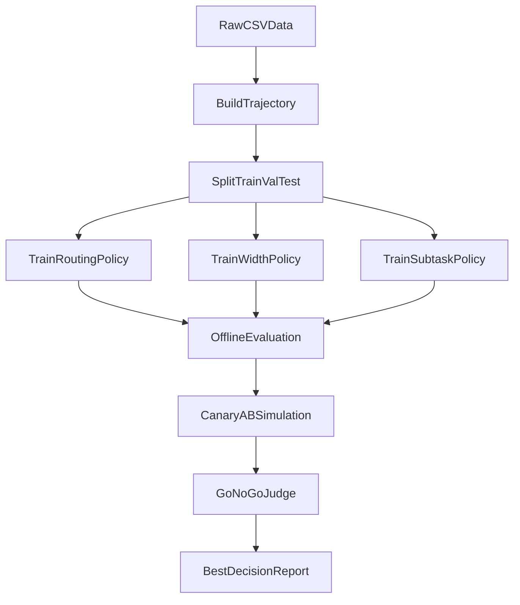

# WideSeek-R1 落地最终说明（唯一版本）

## 1. 这份文档回答什么

这份文档一次性回答四个问题：

1. 和 WideSeek-R1 论文是什么关系  
2. 训练的主体是什么（到底训了谁）  
3. 输入数据是什么、从哪里来  
4. 怎么训练、怎么评估、当前结果是什么  

---

## 2. 和论文的关系（最重要）

参考论文：  
- [WideSeek-R1: Exploring Width Scaling for Broad Information Seeking via Multi-Agent Reinforcement Learning (arXiv:2602.04634)](https://arxiv.org/abs/2602.04634)

### 2.1 我们参考并落地了什么

- **宽度扩展（Width Scaling）**：把单路评测改为可并行、多视角评测。
- **Lead-Subagent 编排思想**：控制器统一编排，子任务受控执行后聚合。
- **联合优化目标**：质量、成本、时延、稳定性一起优化，不只看分数。
- **轨迹可审计**：每轮动作、延迟、分歧、回退都可导出复盘。

### 2.2 我们暂时没做什么

- 暂未做端到端大模型 MARL 联训。  
- 当前是**策略层训练**（Contextual Bandit / LinUCB），先把工程闭环跑通。

---

## 3. 训练主体是什么（不是训练大模型）

本项目训练的是“决策策略器”，不是 LLM 模型权重本身。

### 3.1 评测路由策略（Eval Routing）
- 动作：`rule_only / llm_single / llm_multi`
- 脚本：`reproduce_results/calc_eval_policy.py`

### 3.2 宽度选择策略（Width Policy）
- 动作：`w=1/2/4/8`（对应 `width_1/2/4/8`）
- 脚本：`reproduce_results/calc_width_policy.py`

### 3.3 子任务启用策略（Subtask Policy）
- 动作：`subtasks_0/1/2/3`
- 脚本：`reproduce_results/calc_subtask_policy.py`

---

## 4. 输入数据是什么、从哪里来

先直接回答你的问题：  
**是的，当前这轮训练用的就是 `reproduce_results/data` 目录下的数据。**

### 4.1 主要输入文件

| 文件 | 用途 | 典型字段 |
|---|---|---|
| `reproduce_results/data/evaluations.csv` | 每轮评测主数据 | `overall_score`, `provenance`, `missing_points` |
| `reproduce_results/data/asked_questions.csv` | 每轮题目上下文 | `session_id`, `round`, `difficulty`, `chapter` |
| `reproduce_results/data/sessions.csv` | 会话级信息 | `session_id`, `track`, `n_questions` |
| `reproduce_results/data/eval_policy_trajectory.csv`（可选） | 已结构化轨迹 | `action`, `reward`, `latency_ms`, `instability` |

### 4.2 轨迹构建规则

- 优先读取 `eval_policy_trajectory.csv`
- 若缺失，自动从 `evaluations.csv` bootstrap 生成轨迹
- 实现：`reproduce_results/wideseek_data_utils.py`

### 4.4 当前这次实际用到的数据范围（避免歧义）

- 本次快照统计见：`reproduce_results/output/tab_training_snapshot.csv`
- 当前样本规模：
  - 总行数：`94`
  - train：`57`
  - val：`8`
  - test：`29`

也就是说，这次策略训练与评估是基于 `reproduce_results/data` 的这批历史样本完成的。

### 4.3 可复现快照

- 脚本：`reproduce_results/calc_training_snapshot.py`
- 产物：
  - `tab_training_snapshot.csv`
  - `snapshot_eval_policy_trajectory.csv`
  - `snapshot_manifest.json`

---

## 5. 怎么训练（具体到算法）

先直接回答你的问题：  
**训练目的不是“让模型更会说”，而是“让系统每一轮做更好的决策”。**

### 5.1 算法

- 使用 **LinUCB（Contextual Bandit）**
- 实现：`reproduce_results/eval_policy_utils.py`
  - `train_linucb_eval(...)`
  - `evaluate_eval_policy(...)`

### 5.2 输入特征（每轮状态）

- `round_progress`
- `answer_length`
- `recent_avg_score`
- `missing_points_count`
- `fallback_count`
- `llm_calls_used`
- `multi_judge_used`
- `llm_available`
- `multi_judge_enabled`
- （含 bias）

### 5.3 奖励函数（平衡目标）

`reward = quality - alpha*cost - beta*latency - gamma*instability`

权重扫描输出：
- `tab_eval_policy_reward_sweep.csv`
- `tab_joint_reward_sweep.csv`

当前最优权重：
- `alpha=0.05`
- `beta=0.05`
- `gamma=0.05`

### 5.4 训练目的（业务语言）

每轮策略都在回答同一个问题：  
“这轮应该怎么评，才能在保证质量的前提下，尽量少花钱、少耗时、少回退？”

对应优化目标：
- 质量更稳定（高质量回答不被误伤，低质量回答能被识别）
- 成本更可控（避免不必要的高开销评测）
- 时延更低（减少慢路径）
- 稳定性更好（减少 fallback / 不稳定分歧）

---

## 6. 怎么评估（怎么判是否可上线）

### 6.1 离线训练评估

- `tab_eval_policy.csv`
- `tab_eval_policy_ablation.csv`
- `tab_width_policy.csv`
- `tab_subtask_policy.csv`

### 6.2 灰度 AB 仿真

- 脚本：`reproduce_results/calc_canary_abtest.py`
- 输出：`tab_canary_abtest.csv`（10/30/50/100）

### 6.3 Go/No-Go 门槛判定

- 脚本：`reproduce_results/calc_go_nogo.py`
- 输出：`tab_go_nogo.csv`
- 判定门槛：
  - Quality Delta >= 3%
  - Cost Delta <= 10%
  - P95 Latency Delta <= 15%
  - Fallback Delta <= 0%

---

## 7. 当前最终结果

来自：
- `reproduce_results/output/tab_best_config.csv`
- `reproduce_results/output/best_decision_report.md`

结果：
- `Decision = GO`
- `Recommended Stage = 10%`

10%阶段关键增益：
- `Quality Delta = +8.415%`
- `Cost Delta = -36.744%`
- `P95 Latency Delta = -45.07%`
- `Fallback Delta = 0.0%`

### 7.1 对线上应用效果“到底意味着什么”

这里要区分两层口径：

1. **已验证（离线仿真口径）**  
   来自 `tab_canary_abtest.csv` 与 `tab_go_nogo.csv`，当前结果是 `GO`，并在推荐阶段 `10%` 显示质量提升、成本下降、时延下降。

2. **待验证（真实线上口径）**  
   虽然离线推荐是从 `10%` 开始更稳妥，但如果业务决定“直接全量上线”，则需要把“分阶段验证”替换为“全量实时监控 + 快速回滚”机制。  
   也就是说：可以直接上，但结论口径应是“全量上线中验证”，而不是“上线前已完全确认全量收益”。

结论：
- 当前可以说“离线证据充分，可支持直接上线决策”；
- 线上收益是否与离线一致，需靠上线后监控数据在 1~3 天内确认。

### 7.2 直接上线操作清单（可复制）

1) **上线配置（全量）**  
在运行环境设置或确认以下键值：

```bash
ENABLE_AGENT_CONTROLLER=true
ENABLE_EVAL_POLICY_AGENT=true
EVAL_POLICY_STRATEGY=contextual_bandit
ENABLE_TOOL_ROUTING=true
ENABLE_MULTI_JUDGE=true
ENABLE_FOLLOWUP_PLANNER=true
ENABLE_AGENT_TRACING=true
ENABLE_WIDE_SUBTASK_PLANNER=true
ROLLOUT_VARIANT=wideseek_w2
ROLLOUT_PERCENT=100
```

2) **启动后立刻核验（5~10 分钟）**  
- 抽查 `policy_meta.rollout_variant` 是否为 `wideseek_w2`；  
- 抽查 `policy_meta.action` 是否出现 `llm_single/llm_multi/rule_only` 的动态路由；  
- 抽查 `policy_meta.latency_ms`、`policy_meta.instability` 是否有值；  
- 抽查 `tool_records` 中是否出现 `llm_judge_worker`（多评委并发痕迹）。

3) **上线后每日必看 4 项**  
- 质量：`overall_score` 日均（不低于历史基线）；  
- 成本：`estimated_cost` 或 LLM 调用量（日增幅受控）；  
- 时延：`latency_ms` 的 P95（不超过预算阈值）；  
- 稳定性：`fallback_rate` 与 `instability`（不持续升高）。

4) **一键回滚策略（出现异常立即执行）**  
将以下开关改回保守模式并重启服务：

```bash
ENABLE_EVAL_POLICY_AGENT=false
ENABLE_AGENT_CONTROLLER=false
ROLLOUT_VARIANT=control
ROLLOUT_PERCENT=0
```

回滚后系统会退回原有规则优先路径，确保服务连续性。

---

## 8. 一张图看全流程



---

## 9. 代码入口索引

- 数据与快照：
  - `reproduce_results/wideseek_data_utils.py`
  - `reproduce_results/calc_training_snapshot.py`
- 训练：
  - `reproduce_results/calc_eval_policy.py`
  - `reproduce_results/calc_eval_policy_ablation.py`
  - `reproduce_results/calc_width_policy.py`
  - `reproduce_results/calc_subtask_policy.py`
- 评估与决策：
  - `reproduce_results/calc_canary_abtest.py`
  - `reproduce_results/calc_go_nogo.py`
  - `reproduce_results/calc_best_report.py`
- 总入口：
  - `reproduce_results/reproduce.py`

